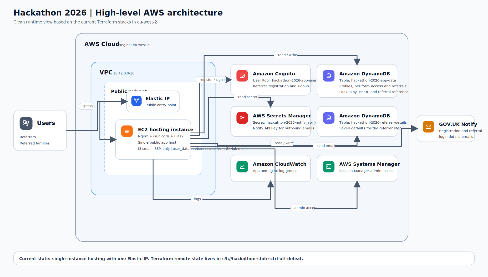

# Family Hub Referral Portal


(High level diagram generated by AI)

Live app: http://3.11.190.150

Test admin username: `admin`

Test admin password: `admin`

## The Problem: Paper-Based Friction
Early years professionals and healthcare staff (such as midwives or nursery workers) currently navigate a heavily manual, paper-based workflow to refer families to Family Hubs. The existing 4-page PDF ("Request for Children's Centre Service") creates significant administrative friction:
- **No Visibility:** Neither the referrer nor the family can track the progress of a referral once sent.
- **Administrative Burden:** Staff spend valuable time manually completing and emailing PDFs.
- **High Friction for Families:** Parents repeat basic information and face delays in receiving support.

## The Solution: A Streamlined Digital Service
This application replaces the legacy PDF process with a streamlined, GOV.UK-styled digital portal. It provides:
- **Instant Submissions:** Rapid digital registration and referral submission.
- **Progress Tracking:** Real-time visibility for both professionals and families.
- **Automated Routing:** Ensures referrals reach the right caseworkers faster.

## User Types

- **Referrers (Professionals):** Early years professionals or healthcare staff who register an account to submit referrals. They can view a dashboard of all their submitted referrals and track their status.
- **Referees (Families):** Parents or carers who receive a unique reference number and postcode via email. They can log in to view their referral details and confirm their acceptance of the service.

## Database Modes

The application supports two backend modes, configurable via the `APP_BACKEND` environment variable:

1. **Local Mode (`APP_BACKEND=local`, default):**
   - Uses in-memory storage.
   - Data is reset when the application restarts.
   - Ideal for rapid local development and testing without AWS credentials.

2. **AWS Mode (`APP_BACKEND=aws`):**
   - Uses **AWS Cognito** for secure professional user authentication.
   - Uses **Amazon DynamoDB** for persistent storage of referrals and user profiles.
   - Requires valid AWS configuration (see [Terraform deploy](#terraform-deploy)).

## Setup

Requires [uv](https://docs.astral.sh/uv/).

```bash
uv python install 3.13
uv sync
```

## Run

```bash
uv run python run.py
```

Then open `http://localhost:5000`.

## Terraform deploy

Uses the shared S3 backend bucket `hackathon-state-ctrl-atl-defeat`.

```powershell
$env:AWS_PROFILE='co-hackathon'
terraform -chdir=infra/cognito/src init
terraform -chdir=infra/cognito/src plan -out=tfplan
terraform -chdir=infra/cognito/src apply tfplan
```

```powershell
$env:AWS_PROFILE='co-hackathon'
terraform -chdir=infra/dynamodb/src init
terraform -chdir=infra/dynamodb/src plan -out=tfplan
terraform -chdir=infra/dynamodb/src apply tfplan
```

```powershell
$env:AWS_PROFILE='co-hackathon'
terraform -chdir=infra/hosting/src init
terraform -chdir=infra/hosting/src plan -out=tfplan
terraform -chdir=infra/hosting/src apply tfplan
```

Hosting clones the app from GitHub `main` onto the EC2 instance.
