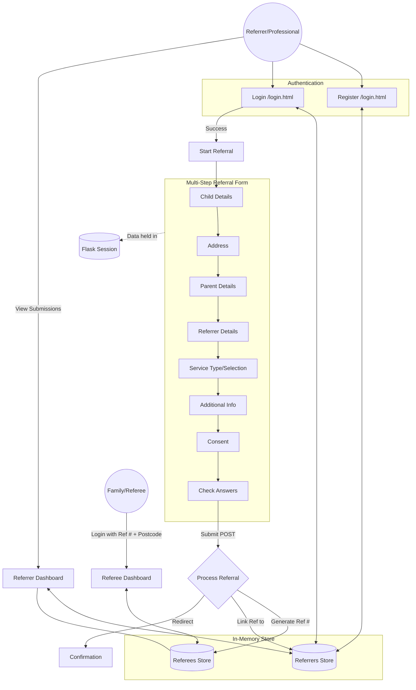

# Data Flow Diagram

This diagram visualises how data moves through the application, from user authentication to referral submission and dashboard access.

## Key Components

### 1. Flask Session
During the referral process, data is temporarily stored in the `session["answers"]` dictionary. This prevents data loss as the user moves between steps and allows for the "Back" button functionality.

### 2. In-Memory Store (`app/store.py`)
- **Referrers:** Stores user credentials (hashed) and a list of reference numbers they have submitted.
- **Referees:** Stores the full details of a submitted referral, keyed by a unique 8-character reference code.

### 3. Data Persistence
Upon clicking "Accept and send" on the **Check** page:
1. A unique reference ID is generated.
2. The data is moved from the **Session** to the **Referees Store**.
3. The reference ID is appended to the **Referrer's** list of submissions.
4. The session is cleared of the temporary answers.
